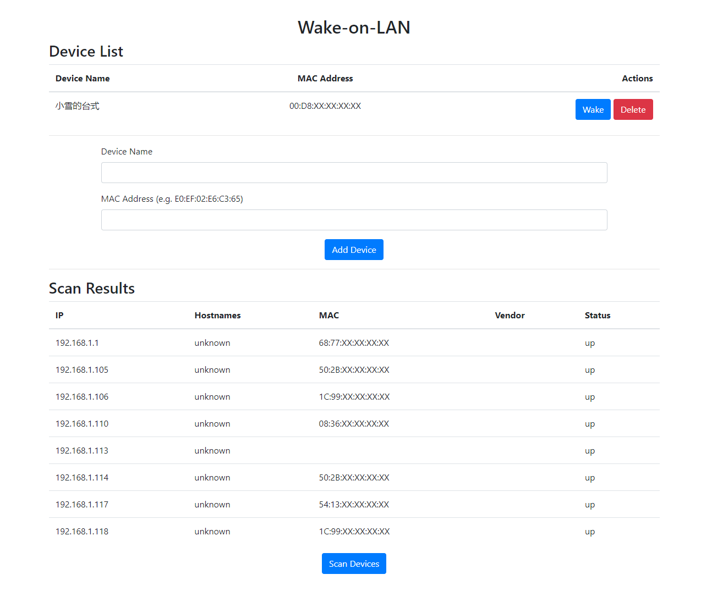

# pyWakeOnLAN-WebGUI

## Description:

This Python project offers a user-friendly web interface for remotely waking up devices on your network using the Wake-on-LAN (WoL) protocol. It leverages Flask for web development, wakeonlan for sending magic packets, and nmap for network scanning.

## Key Features

- Manage device list:
- Add devices with their names and MAC addresses.
- View and edit existing devices.
- Delete devices from the list.
- Wake devices:
    - Send magic packets to wake up devices on the network using their MAC addresses.
- Scan network:
    - Discover devices on your network and display their information, including IP addresses, hostnames (if available), MAC addresses, vendors, and status.

## Dependencies:

- Flask
- wakeonlan
- nmap (Python-nmap)

## Installation:

Clone the repository or download the project files.

Install the required dependencies using pip:

```Bash
pip install Flask wakeonlan python-nmap
```

Test
Access the web interface in your browser, typically at http://localhost:5000/a520.

```
python app.py
``````

## Explanation:

The app.py file contains the core Flask application logic, including routing, device management, and network scanning functions.
The templates directory holds the HTML templates used for the web interface.


## Customization:

You can modify the urlprefix variable in app.py to adjust the base URL for accessing the app (e.g., from /a520 to /wol).
Consider adding authentication or authorization mechanisms if needed for production use.
Contributing:

Contributions are welcomed to improve this project.

### CDN settings

The default cdn settings is for Chinese users. For users in other parts of the world, please comment on the link and script settings below and uncomment them above.

```html
<!-- For global users -->
<!-- <link rel="stylesheet" href="https://stackpath.bootstrapcdn.com/bootstrap/4.3.1/css/bootstrap.min.css"> -->
<!-- <script src="https://code.jquery.com/jquery-3.3.1.slim.min.js"></script> -->
<!-- <script src="https://cdnjs.cloudflare.com/ajax/libs/popper.js/1.14.7/umd/popper.min.js"></script> -->
<!-- <script src="https://stackpath.bootstrapcdn.com/bootstrap/4.3.1/js/bootstrap.min.js"></script> -->

<!-- For Chinese users -->
<link href="https://cdn.bootcdn.net/ajax/libs/twitter-bootstrap/4.3.1/css/bootstrap.min.css" rel="stylesheet">
<script src="https://cdn.bootcdn.net/ajax/libs/jquery/3.3.1/jquery.slim.min.js"></script>
<script src="https://cdn.bootcdn.net/ajax/libs/popper.js/1.14.7/umd/popper.min.js"></script>
<script src="https://cdn.bootcdn.net/ajax/libs/twitter-bootstrap/4.3.1/js/bootstrap.min.js"></script>
```

## Additional Notes:

Ensure that your devices are WoL-enabled and configured correctly for remote wake-up.
The network scanning functionality might require elevated privileges on some systems.

## Screenshot

